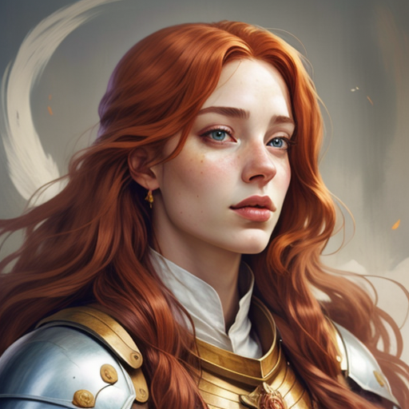
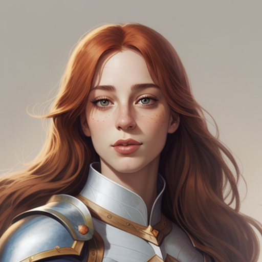
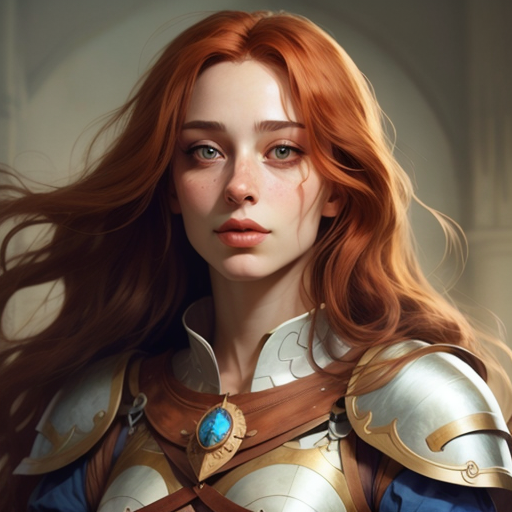
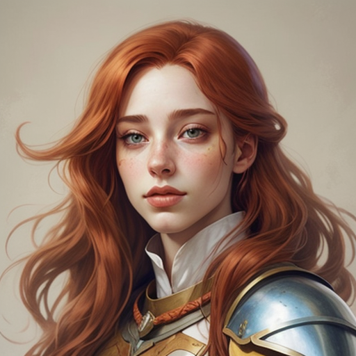

# IPAdapter implementation for :hugs: Diffusers

This is an alternative implementation of the [IPAdapter](https://github.com/tencent-ailab/IP-Adapter) models for Huggingface Diffusers. The main differences with the offial repository:

- supports multiple input images (instead of just one)
- supports weighting of input images
- supports negative input image (sending noisy negative images arguably grants better results)
- shorter code, easier to maintain
- streamlined workflow with only one main class (`IPAdapter`) instead of one for each model (base, sdxl, plus, ...)

I've also worked on an [extention for ComfyUI](https://github.com/cubiq/ComfyUI_IPAdapter_plus) that supports the same features and much more.



## Installation

It works with any standard diffusers environment, it doesn't require any specific library. For the sake of completeness I've included a `requirements.txt` file you can use to create a vanilla python environment (for cuda).

The examples cover most of the use cases. They should be self explanatory. Rename `config.py.sample` to `config.py` and fill your model paths to execute all the examples.

The IPAdapter models can be found on [Huggingface](https://huggingface.co/h94/IP-Adapter).

Remember that **SDXL vit-h** models require **SD1.5 image encoder** (even if the base model is SDXL).

## Example

A basic example would be:

```python
from diffusers import StableDiffusionPipeline, DDIMScheduler

import torch
from PIL import Image

import config as cfg
from ip_adapter.ip_adapter import IPAdapter

device = "cuda"

pipe = StableDiffusionPipeline.from_single_file("path/to/model", torch_dtype=torch.float16)
pipe.safety_checker = None
pipe.feature_extractor = None
pipe.scheduler = DDIMScheduler.from_config(pipe.scheduler.config)
pipe.to(device)

image1 = Image.open("reference_image.jpg")

ip_adapter = IPAdapter(pipe, "ipdapter/model/path", "image/encoder/path", device=device)

prompt_embeds, negative_prompt_embeds = ip_adapter.get_prompt_embeds(
    image1,
    prompt="positive prompt",
    negative_prompt="blurry,",
)

generator = torch.Generator().manual_seed(1)

image = pipe(
    prompt_embeds=prompt_embeds,
    negative_prompt_embeds=negative_prompt_embeds,
    num_inference_steps=30,
    guidance_scale=6.0,
    generator=generator,
).images[0]
image.save("image.webp", lossless=True, quality=100)
```

## Suggestions/Recommendations

The negatives are important, be sure to add at least "blurry" and possibly more ("low quality" and whatever).

The IPAdapter models tend to burn the image, increase the number of steps and lower the guadance scale.

Sending random noise negative images often helps. Check the example below

| Reference (no negatives) | Basic Noise | Mandelbrot Noise |
| --- | --- | --- |
|  |  |  |

PS: The cover image at the top of the page is generated with mandelbrot noise

You can play with other sort of noise and negative images. Let me know if you find a cool one.

Weighting of images is supproted but I'm sure there's a better way to weight the embeds. Suggestions are welcome here.

Remember that images, negative images and weights **must be lists of all the same size**.

## Disclaimer

This can be still considered a proof of concept. I'm new to diffusers and I'm not sure what are the best practices. This code is offered mainly to show the possibilities of the IPAdapter models that are not exploited in the official repository.

The only way to have this whole ordeal to work is by merging all the embeddings, that means that you may end up with a huge tensor. Not sure why I can't just concat them, as I said I haven't spent much time with Diffusers.
